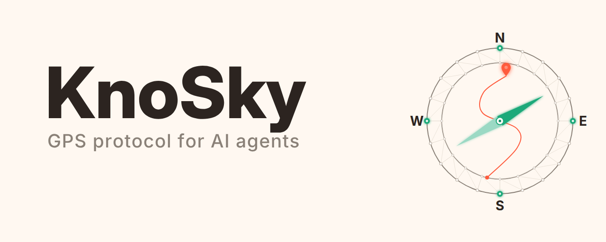
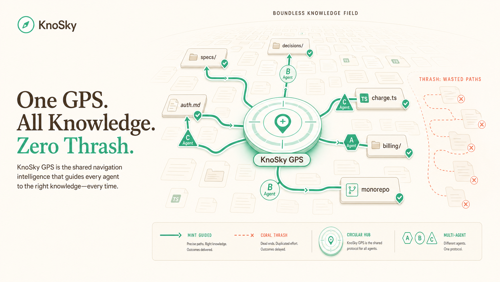

<div align="center">



# KnoSky

### GPS for AI agents — local map, cited routes, optional receipts

**Stop paying for thrash. Stop uploading the estate. Prove what the map of your repo did.**

[](https://www.knosky.com)
[](https://knosky.wiki)
[](https://www.npmjs.com/package/knosky)
[](https://nodejs.org)
[](./LICENSE.md)

**[Website ↗](https://www.knosky.com)** · **[Docs ↗](https://knosky.wiki)** · [Install](#60-second-start) · [Outcomes](#the-outcome) · [In the box](#whats-in-the-box) · [Enterprise path](#enterprise--regulated-path) · [Connect](#connect-an-assistant)

Works with **Claude Code · Cursor · Codex · Hermes · VS Code** (and neighbors) via a shared MCP menu. One local install. Your code stays on the machine.



<em>Product GPS hub (circular — never a diamond). City view is the human skin, not the agent metaphor.</em>

</div>

<details>
<summary><b>Table of contents</b></summary>

- [The problem](#the-problem)
- [The solution](#the-solution)
- [The outcome](#the-outcome)
- [60-second start](#60-second-start)
- [What's in the box](#whats-in-the-box)
- [Enterprise / Regulated path](#enterprise--regulated-path)
- [Connect an assistant](#connect-an-assistant)
- [Guarantee ladder & honesty](#guarantee-ladder--honesty)
- [CLI cheat sheet](#cli-cheat-sheet)
- [What it is not](#what-it-is-not)
- [Privacy & safety](#privacy--safety)
- [License](#license--credits)

</details>

---

## The problem

AI coding tools are expensive when they **guess**.

| Waste you already feel | Why it hurts |
| :--- | :--- |
| **Wrong files, long loops** | Tokens and tool calls burn while agents wander monorepos |
| **Meetings that ocean-chart the codebase** | Senior time spent “where does X live?” instead of shipping |
| **Answers nobody can verify** | Hallucinated paths — no citation trail |
| **Cloud “repo brain” that wants a copy** | Security kills the POC; data residency and exfil risk |
| **Pretty demo, no re-runnable proof** | CISO can’t replay what was indexed, shared, or refused |

Industry keeps scoring the **token bill** of agentic workflows. KnoSky attacks a different layer: **navigation waste** — agents without a shared local map. Complementary to code intelligence and IDEs, not a replacement.

---

## The solution

**KnoSky is local-first agent GPS** for repos and docs:

1. **Map** the folder on **your machine** (no cloud body store).  
2. **Route** assistants through one frozen MCP menu (search, node, provenance, optional allow/deny).  
3. **Cite** so answers link to something real.  
4. Optionally flip **Enterprise / Regulated Mode** for security report, audit pack/verify, architecture hangboard, and a **private** synthetic attack gauntlet.

> **Trust model (approved wording):** KnoSky's local trust model applies the core security principles of TUF — role separation, threshold signing, survivable key compromise, and freshness-guaranteed revocation — adapted from TUF's server-oriented update distribution to a fully local, no-egress agentic environment, with attestation formats based on in-toto/DSSE.

---

## The outcome

### Efficiency you can point at

From **our own** small guided-vs-wandering study (5 tasks — not someone else’s marketing deck):

| Metric | Result |
| :--- | ---: |
| Tokens | **−68%** with guided map vs wandering |
| Tool calls | **−70%** |
| Time-to-right-file | **6× faster** |
| Guided hit rate | **5 / 5** correct |
| Wandering | Target sometimes found, **0 / 5** correct |

*First-party evidence only. Industry write-ups measure other stacks — they amplify the problem, they are not KnoSky’s hero math.*

### Risk averted (what a careful CTO / CISO cares about)

| Risk without a local GPS layer | With KnoSky |
| :--- | :--- |
| Cloud tool insists on a **copy of source** | **Local-first** — default path does **not** upload your bodies as KnoSky product storage |
| Assistants **write / run** under the best marketing smile | **Map tools are read-only** (search / get / provenance) — documented in [`docs/READ_ONLY_GUARANTEE.md`](./docs/READ_ONLY_GUARANTEE.md) |
| Shared map dumps **secrets or laptop paths** | **Share-safe** indexing **fails closed** on secret-like values; absolute roots stripped |
| “Trust us” with **no paper** | **Security report** + **`audit pack` / `audit verify`** a stranger can re-run |
| Thin docs and unknown ownership until outage week | **`intel`** district scores — docs / ownership / tests / churn / drift / risk (local proxies) |
| Private attack proof that never exists | **Private synthetic gauntlet** (8 classes) — stays **private** unless Owner explicitly publishes |

### Cost & outcome in one line

**Less thrash spend · less senior scavenger time · fewer dead AI POCs after Security · fewer “who owns this district?” workshops · same folder your agents already open.**

| Without KnoSky | With it |
| :--- | :--- |
| Agent pays full tourist fare in the monorepo | Route toward the right node with a **shared map** |
| Security review is a deck of hope | Re-runnable **doctor** + **security report** + **audit verify** |
| Share a city HTML with crossed fingers | Fail-closed share-safe or **don’t ship the artifact** |
| Swarm marketing language | **Doctor-honest ceilings** — L3 coordinator = **foundation**, not fleet-everywhere |

---

## 60-second start

```bash
npx knosky@latest .
```

Indexes **this folder**, builds the city, prints MCP config + starter prompts, starts the local connector.

```bash
npx knosky@latest doctor
```

**Requirements:** [Node.js](https://nodejs.org) **20+**.

Clone:

```bash
git clone https://github.com/SathiaAI/knosky
cd knosky && npm install
node bin/knosky.mjs .
```

Flags: `--no-open`, `--no-serve`.

---

## What's in the box

| Piece | What you get |
| :--- | :--- |
| **Local maze map** | Indexer for correct folders on **your** disk |
| **City HTML** | Human skin (isometric) for the same graph |
| **MCP GPS tools** | Frozen menu: map lookup + optional governed route/bundle/policy |
| **Mode A / Mode B** | Advisory tips **or** identity + policy + audit receipts |
| **Packs** | Claude · Cursor · Codex · Hermes (+ VS Code / Greptile recipe / PR-GPS) |
| **`doctor`** | Health + honesty for *this* install |
| **Enterprise profile** | Named safer defaults, security report, capability matrix |
| **`audit pack` / `verify`** | CISO-style portable evidence folder |
| **`intel`** | Architecture hangboard per district |
| **Private adversarial gauntlet** | Synthetic hosts · multi-role checks · rollup (**not public by default**) |
| **L3 coordinator foundation** | Local multi-helper leases/claims/heatmap/bench — **not** cloud fleet product |
| **PR-GPS Action** | Advisory PR comments — **never blocks** the build by default |

**Not in the box:** coding model replacement · cloud vault of everyone’s source · “swarm-safe production factory everywhere” · SOC2 certificate pealed from a report file · automatic public attack-pack publish.

---

## Enterprise / Regulated path

For pilots that need **proof**, not just a pretty city. Casual install still works — this is an **opt-in jacket**.

```bash
# From clone (or package bin once these subcommands ship on your npm line)
node bin/knosky.mjs enterprise . --no-open --no-serve
node bin/knosky.mjs doctor
node bin/knosky.mjs audit pack --root .
node bin/knosky.mjs audit verify PASTE_BUNDLE_DIR_HERE
node bin/knosky.mjs intel .
```

| Step | Saves / avoids |
| :--- | :--- |
| **Enterprise index** | Fail-closed secrets · stripped absolute paths · security summary |
| **Doctor ENT rows** | Clear “profile active / report present / map RO vs Mode B” |
| **Audit pack + verify** | Security re-checks **without** a vendor meeting |
| **Intel** | Week-2 architect attention list without a slide workshop |
| **`adversarial run`** | Private synthetic proof (secrets, ignores, traversal, injection, stale, …) |

Private gauntlet (synthetic only — **never customer data**):

```bash
node bin/knosky.mjs adversarial list
node bin/knosky.mjs adversarial run
# optional live model reviewer: OPENROUTER_API_KEY or ANTHROPIC_API_KEY + KS_ADV_LLM=1 + --llm
```

Owner walkthroughs:  
[`OWNER-DEMO-ENT-PHASE1.md`](./OWNER-DEMO-ENT-PHASE1.md) ·  
[`OWNER-DEMO-ENT-PHASE2.md`](./OWNER-DEMO-ENT-PHASE2.md) ·  
[`OWNER-DEMO-ENT-PHASE3.md`](./OWNER-DEMO-ENT-PHASE3.md)

---

## Connect an assistant

SSOT menu: [`ssot/tool-menu.json`](./ssot/tool-menu.json) · codes · ladder under `ssot/`.  
Packs: [`packs/`](./packs/).

```bash
claude mcp add knosky \
  -e KC_CITY=/abs/path/.knosky/city-data.json \
  -e KC_PROFILE=coding \
  -- node /abs/path/mcp/server.mjs
```

| Profile | Used for |
| :--- | :--- |
| **coding** (default) | Map + governed tools |
| **security** | + audit query/verify |
| **advisory** | Explicit non-authorizing explore |

**Mode A** = labeled advisory only. **Mode B** = `ALLOW` / `DENY_*` with lease + policy + audit before *authorized* claims.  
Mint a lease: `npx knosky@latest agent-register --domain .knosky --agent my-agent`.

**Map tools (read-only):** `kc_search` · `kc_get_node` · `kc_list_categories` · `kc_get_provenance` · `kc_related`  
**Governed:** `kc_route` · `kc_bundle` · `kc_policy_check`  
Details: [`docs/READ_ONLY_GUARANTEE.md`](./docs/READ_ONLY_GUARANTEE.md)

---

## Guarantee ladder & honesty

| L | Name | Promise |
| :---: | :--- | :--- |
| **L0** | Local map | Navigate locally — no KnoSky source upload by default |
| **L1** | Share-safe | Fail-closed secret controls before share artifacts |
| **L2** | Governed evaluator | Mode B identity + policy + audit (or safe DENY) |
| **L3** | Multi-helper domain | **Coordinator foundation** on the local domain — not multi-tenant fleet SaaS |

```bash
npx knosky@latest doctor
npx knosky@latest swarm status --domain .knosky
# bench only on a throwaway domain — never your live .knosky
npx knosky@latest swarm bench --domain /tmp/knosky-swarm-bench
```

**You may say:** local GPS, cited map tools, optional Mode B receipts, enterprise security report/audit pack, private synthetic gauntlet, architecture hangboard, L3 **foundation**.  
**You must not say:** production swarm-safe fleet everywhere · dual-control operator lease revoke by default · “no egress guaranteed on Windows” without packaging proof · public attack-tested as marketing without Owner publish seek · SOC2 from a JSON report alone.

**Lease revoke (accepted Wave-1 risk):** holder **or** a **single** valid operator token — **not** dual quorum on revoke. Dual quorum applies to **elevated registration**. See [SECURITY.md](./SECURITY.md).

**Windows:** runtime network lockdown is not kernel-enforced for this CLI — [LIMITATIONS.md](./LIMITATIONS.md).

---

## CLI cheat sheet

| Command | Job |
| :--- | :--- |
| `npx knosky@latest .` | Map + city + connector |
| `… doctor` | Honesty scorecard |
| `node bin/knosky.mjs enterprise . --no-serve` | Enterprise profile + security report |
| `… audit pack` / `audit verify` | Evidence bundle |
| `… intel .` | Architecture intelligence |
| `… adversarial list\|run` | Private synthetic gauntlet |
| `… agent-register` | Mode B lease |
| `… swarm status\|bench` | L3 foundation ops |

---

## What it is not

- Not an IDE or full code-intelligence product  
- Not a multi-tenant cloud vault of source  
- Not an autonomous “run the business” agent  
- Not “zero residual risk” or finished multi-helper factory  
- Not auto-public attack marketing after a private green  

## Privacy & safety

- Local by default; skips common secret-ish paths and ignore rules  
- Scrub + fail-closed share-safe  

More: [PRIVACY.md](./PRIVACY.md) · [SECURITY.md](./SECURITY.md) · [LIMITATIONS.md](./LIMITATIONS.md) · [CHANGELOG.md](./CHANGELOG.md)

## License & credits

**[FSL-1.1-MIT](./LICENSE.md)** — free to use; no competing hosted side-sell; converts toward MIT on schedule. “KnoSky” trademark of the author.

City art: **[Kenney](https://kenney.nl)** (CC0) — [CREDITS.md](./CREDITS.md).

---

<div align="center">

**Map locally. Cite answers. Prove the ceiling.**

[knosky.com](https://www.knosky.com) · [knosky.wiki](https://knosky.wiki) · [npm knosky](https://www.npmjs.com/package/knosky)

</div>
